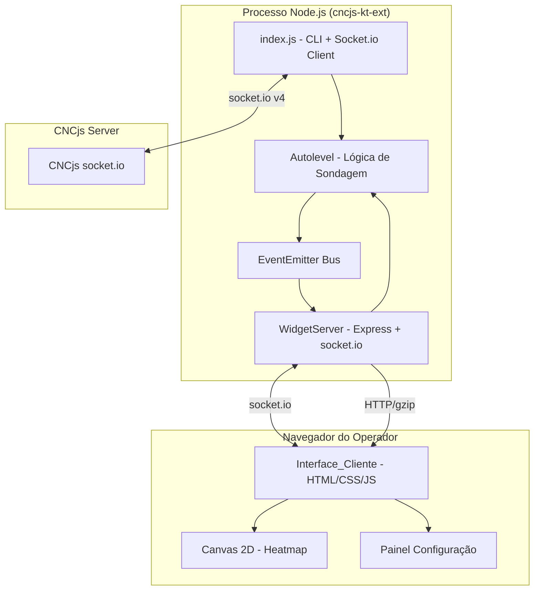
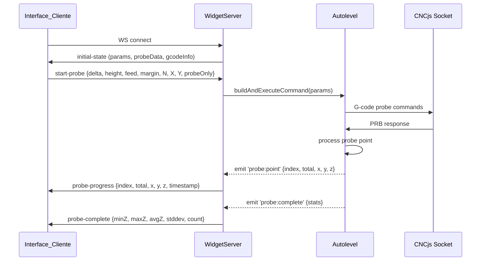

# Design Document

## Overview

Este documento descreve o design técnico do widget web para auto-nivelamento, um servidor HTTP/WebSocket embutido no processo da extensão cncjs-kt-ext. O widget expõe uma interface gráfica via navegador que permite ao operador CNC visualizar o mapa de alturas, configurar parâmetros de sondagem, iniciar/parar a sondagem e gerenciar arquivos de dados — tudo sem modificar o fluxo existente de operação via macros.

A arquitetura segue o princípio de adição não-intrusiva: o módulo do widget é carregado condicionalmente (flag `--web-widget`) e se comunica com o `Autolevel` existente via EventEmitter, sem alterar a lógica interna de sondagem ou compensação. O frontend é vanilla JavaScript com Canvas 2D, otimizado para Raspberry Pi 4 (< 500 KB total de assets).

### Decisões de Design Principais

1. **Express + socket.io no mesmo processo**: Reutiliza o event loop Node.js existente, evitando IPC e mantendo acesso direto ao estado do Autolevel.
2. **EventEmitter como barramento interno**: O Autolevel emite eventos (`probe:start`, `probe:point`, `probe:complete`, `probe:error`) que o widget server escuta e retransmite ao cliente.
3. **Canvas 2D para heatmap**: Renderização leve e compatível com Chromium em RPi4, sem dependência de WebGL.
4. **Cálculo de grade no cliente**: A Interface_Cliente calcula a grade de sondagem localmente (sem round-trip ao servidor) para feedback instantâneo ao alterar parâmetros.
5. **REST para arquivos, WebSocket para eventos**: Endpoints REST para operações CRUD de arquivos de sondagem; WebSocket para streaming de progresso em tempo real.

## Architecture



### Fluxo de Dados



### Estrutura de Diretórios

```
cncjs-kt-ext/
├── index.js                    # Entry point (adiciona --web-widget flag)
├── autolevel.js                # Adiciona EventEmitter mixin
├── widget-server.js            # NEW: Express + socket.io server
├── widget-api.js               # NEW: REST API handlers (file management)
├── public/                     # NEW: Static assets (served by Express)
│   ├── index.html              # Single page app
│   ├── css/
│   │   └── widget.css          # Estilos (< 15 KB)
│   ├── js/
│   │   ├── app.js              # Entry point do cliente
│   │   ├── heatmap.js          # Canvas 2D rendering
│   │   ├── grid-calculator.js  # Cálculo de grade (client-side)
│   │   ├── stats.js            # Cálculos estatísticos
│   │   ├── validation.js       # Validação de parâmetros
│   │   └── socket-client.js    # WebSocket client wrapper
│   └── lib/
│       └── socket.io.min.js    # socket.io client (~40 KB gzipped)
```

## Components and Interfaces

### 1. WidgetServer (`widget-server.js`)

Responsável por inicializar o servidor HTTP/WebSocket e orquestrar a comunicação entre o Autolevel e a Interface_Cliente.

```javascript
/**
 * @class WidgetServer
 * @param {Autolevel} autolevel - Instância do autolevel existente
 * @param {object} options - { port: number }
 */
class WidgetServer {
  constructor(autolevel, options) { }
  
  /** Inicia o servidor Express + socket.io */
  start() { }
  
  /** Para o servidor graciosamente */
  stop() { }
  
  /** Registra listeners nos eventos do Autolevel */
  _bindAutolevelEvents() { }
  
  /** Retransmite evento para todos os clientes conectados (com rate limiting) */
  _broadcastToClients(event, data) { }
}
```

**Interface pública exposta via WebSocket (servidor → cliente):**

| Evento | Payload | Descrição |
|--------|---------|-----------|
| `initial-state` | `{ params, probeData, gcodeInfo }` | Estado inicial ao conectar |
| `probe-progress` | `{ index, total, x, y, z, timestamp }` | Ponto sondado |
| `probe-complete` | `{ minZ, maxZ, avgZ, stddev, count, success }` | Sondagem concluída |
| `probe-error` | `{ message, pointIndex }` | Erro durante sondagem |
| `gcode-changed` | `{ loaded, fileName, bounds }` | G-code carregado/descarregado |
| `state-changed` | `{ probing, gcodeLoaded }` | Mudança de estado geral |

**Interface pública exposta via WebSocket (cliente → servidor):**

| Evento | Payload | Descrição |
|--------|---------|-----------|
| `start-probe` | `{ delta, height, feed, margin, N, xSize, ySize, probeOnly }` | Iniciar sondagem |
| `stop-probe` | `{}` | Abortar sondagem |
| `reapply` | `{}` | Re-aplicar compensação |
| `get-state` | `{}` | Solicitar estado atual |

### 2. Widget API (`widget-api.js`)

Endpoints REST para gerenciamento de arquivos de sondagem.

```javascript
/**
 * @param {Express.Router} router - Express router
 * @param {Autolevel} autolevel - Instância do autolevel
 * @param {string} workDir - Diretório de trabalho para arquivos
 */
function registerWidgetAPI(router, autolevel, workDir) { }
```

**Endpoints REST:**

| Método | Path | Descrição |
|--------|------|-----------|
| `GET` | `/api/probes` | Lista arquivos de sondagem disponíveis |
| `GET` | `/api/probes/:filename` | Lê dados de um arquivo específico |
| `POST` | `/api/probes/:filename` | Salva dados de sondagem atuais |
| `DELETE` | `/api/probes/:filename` | Remove arquivo de sondagem |
| `GET` | `/api/state` | Estado atual (params, probing status, gcode info) |

**Formato de resposta (GET /api/probes/:filename):**
```json
{
  "filename": "board_v2.txt",
  "points": [
    { "x": 0.0, "y": 0.0, "z": -0.052 },
    { "x": 10.0, "y": 0.0, "z": -0.031 }
  ],
  "stats": { "minZ": -0.052, "maxZ": 0.012, "avgZ": -0.018, "stddev": 0.021, "count": 25 }
}
```

### 3. Autolevel EventEmitter Extension

Modificação mínima ao `autolevel.js` existente: adicionar emissão de eventos via `EventEmitter`.

```javascript
const EventEmitter = require('events');

// No constructor do Autolevel, adicionar:
// this.events = new EventEmitter();

// Eventos emitidos:
// this.events.emit('probe:start', { totalPoints, params })
// this.events.emit('probe:point', { index, total, x, y, z })
// this.events.emit('probe:complete', { minZ, maxZ, avgZ, count, success })
// this.events.emit('probe:error', { message, pointIndex })
// this.events.emit('gcode:changed', { loaded, fileName, bounds })
```

A emissão de eventos é adicionada nos pontos existentes do código onde o estado já muda (após `probedPoints.push()`, após `applyCompensation()`, etc.), sem alterar a lógica de controle.

### 4. Interface_Cliente (Frontend)

#### Módulo: `heatmap.js`

```javascript
/**
 * Renderiza o mapa de alturas em Canvas 2D.
 * @param {HTMLCanvasElement} canvas
 * @param {Array<{x,y,z}>} points - Pontos sondados
 * @param {object} options - { colorScale, showGrid, bounds }
 */
class HeatmapRenderer {
  constructor(canvas, options) { }
  
  /** Renderiza todos os pontos */
  render(points) { }
  
  /** Adiciona um ponto incrementalmente (sem re-render completo) */
  addPoint(point) { }
  
  /** Mapeia valor Z para cor RGB */
  static zToColor(z, minZ, maxZ) { }
  
  /** Retorna coordenadas do ponto sob o cursor */
  hitTest(canvasX, canvasY) { }
}
```

#### Módulo: `grid-calculator.js`

```javascript
/**
 * Calcula a grade de sondagem planejada (executa no cliente).
 * Replica a lógica de cálculo de grade do autolevel.start().
 * 
 * @param {object} params - { delta, margin, xMin, xMax, yMin, yMax, xSize, ySize }
 * @returns {{ points: Array<{x,y}>, count: number, estimatedTime: number }}
 */
function calculateGrid(params) { }

/**
 * Estima o tempo de sondagem.
 * @param {number} pointCount - Número de pontos
 * @param {number} height - Altura de viagem (mm)
 * @param {number} feed - Feedrate de sondagem (mm/min)
 * @param {number} probesPerPoint - Probes por ponto
 * @param {number} avgSpacing - Espaçamento médio entre pontos (mm)
 * @returns {number} Tempo estimado em minutos
 */
function estimateTime(pointCount, height, feed, probesPerPoint, avgSpacing) { }
```

#### Módulo: `validation.js`

```javascript
/**
 * Valida um parâmetro de sondagem.
 * @param {string} paramName - Nome do parâmetro ('delta', 'height', 'feed', 'margin', 'nProbes')
 * @param {*} value - Valor a validar
 * @returns {{ valid: boolean, error?: string }}
 */
function validateParam(paramName, value) { }
```

#### Módulo: `stats.js`

```javascript
/**
 * Calcula estatísticas de sondagem incrementalmente.
 * Mantém estado interno para atualização ponto-a-ponto.
 */
class ProbeStats {
  constructor() { }
  
  /** Adiciona um ponto e recalcula estatísticas */
  addPoint(z) { }
  
  /** Recalcula a partir de array completo */
  fromArray(zValues) { }
  
  /** Retorna estatísticas atuais */
  getStats() { } // { minZ, maxZ, avgZ, stddev, count }
  
  /** Classifica amplitude em cor (green/yellow/red) */
  static amplitudeColor(amplitude) { }
}
```

### 5. Rate Limiter

```javascript
/**
 * Limita emissão de eventos WebSocket a maxRate msgs/segundo.
 * Eventos excedentes são descartados (último valor mantido para envio no próximo slot).
 */
class RateLimiter {
  constructor(maxRate) { } // maxRate = 10
  
  /** Retorna true se o evento pode ser emitido agora */
  canEmit() { }
  
  /** Registra emissão */
  recordEmit() { }
}
```

## Data Models

### Estado do Servidor (WidgetServer)

```javascript
{
  // Parâmetros de sondagem (últimos utilizados)
  params: {
    delta: 10.0,        // mm
    height: 2.0,        // mm
    feed: 50,           // mm/min
    margin: 2.5,        // mm (delta/4)
    nProbes: 1,         // 1-10
    xSize: null,        // mm ou null (usar bounds do gcode)
    ySize: null,        // mm ou null
    probeOnly: false
  },
  
  // Estado de sondagem
  probing: {
    active: false,
    currentIndex: 0,
    totalPoints: 0,
    startTime: null
  },
  
  // Dados de sondagem
  probeData: {
    points: [],         // Array<{x, y, z}>
    stats: null         // { minZ, maxZ, avgZ, stddev, count } ou null
  },
  
  // Informação do G-code
  gcodeInfo: {
    loaded: false,
    fileName: '',
    bounds: null        // { xMin, xMax, yMin, yMax } ou null
  }
}
```

### Evento de Progresso (WebSocket payload)

```javascript
{
  index: 5,             // Índice do ponto (1-based)
  total: 25,           // Total de pontos planejados
  x: 10.000,          // Coordenada X (mm, 3 decimais)
  y: 20.000,          // Coordenada Y (mm, 3 decimais)
  z: -0.052,          // Coordenada Z (mm, 3 decimais)
  timestamp: 1700000000000  // Unix timestamp ms
}
```

### Evento de Conclusão (WebSocket payload)

```javascript
{
  success: true,
  minZ: -0.052,
  maxZ: 0.031,
  avgZ: -0.012,
  stddev: 0.021,
  count: 25,
  duration: 180.5      // segundos
}
```

### Formato de Arquivo de Sondagem

Formato texto compatível com o existente (`__last_Z_probe.txt`):
```
X Y Z
0.000 0.000 -0.052
10.000 0.000 -0.031
20.000 0.000 0.012
...
```

Uma linha por ponto, valores separados por espaço, coordenadas em milímetros.

## Correctness Properties

*A property is a characteristic or behavior that should hold true across all valid executions of a system — essentially, a formal statement about what the system should do. Properties serve as the bridge between human-readable specifications and machine-verifiable correctness guarantees.*

### Property 1: Color Mapping Monotonicity

*For any* two Z values z1 and z2 within the probe data range where z1 < z2, the color mapping function SHALL produce colors where z1 maps closer to blue (negative) and z2 maps closer to red (positive), maintaining monotonic progression through the gradient (blue → green → red).

**Validates: Requirements 2.1**

### Property 2: Tooltip Formatting Precision

*For any* probe point {x, y, z} with finite coordinate values, the tooltip formatting function SHALL produce a string containing all three coordinates formatted to exactly 3 decimal places, and parsing those formatted values back SHALL produce numbers within 0.0005 of the originals.

**Validates: Requirements 2.3**

### Property 3: Progress Event Payload Completeness

*For any* probe point completion during an active probing session, the emitted progress event SHALL contain: a valid index (1 ≤ index ≤ total), the total planned points (> 0), finite x/y/z coordinates, and a timestamp that is non-decreasing relative to previous events.

**Validates: Requirements 3.1, 3.4**

### Property 4: Incremental Statistics Correctness

*For any* sequence of Z values added one at a time, the incrementally computed statistics (min, max, avg, stddev, count) SHALL be mathematically equivalent to computing the same statistics from the complete array at each step.

**Validates: Requirements 6.1, 6.2, 3.4**

### Property 5: Amplitude Color Classification

*For any* non-negative amplitude value (max_z - min_z), the color classification SHALL return: green if amplitude < 0.1, yellow if 0.1 ≤ amplitude ≤ 0.3, red if amplitude > 0.3.

**Validates: Requirements 6.3**

### Property 6: Parameter Validation Correctness

*For any* numeric value submitted as a probing parameter, the validation function SHALL accept the value if and only if it satisfies the parameter's constraints (delta > 0, height > 0, feed > 0, margin ≥ 0, nProbes ∈ {1..10} integer), and SHALL reject all other values including NaN, Infinity, negative numbers (where prohibited), and non-integer values for nProbes.

**Validates: Requirements 4.2, 4.3**

### Property 7: Command Construction Fidelity

*For any* valid set of probing parameters {delta, height, feed, margin, N, xSize, ySize, probeOnly}, the constructed #autolevel command string SHALL be parseable back into the same parameter values, and SHALL produce identical behavior when executed by the existing Autolevel.start() parser.

**Validates: Requirements 5.2, 9.5**

### Property 8: Probe Data Serialization Round-Trip

*For any* array of 3 or more non-colinear probe points with finite coordinates, serializing to the text format (X Y Z per line) and then parsing back SHALL produce an array of points where each coordinate differs from the original by less than 0.001 mm.

**Validates: Requirements 7.2, 7.4**

### Property 9: Grid Calculation Correctness

*For any* valid bounds {xMin, xMax, yMin, yMax} and parameters {delta > 0, margin ≥ 0} where the effective area (after margin) has positive dimensions, the calculated grid SHALL: (a) contain only points within the margin-adjusted bounds, (b) have spacing between adjacent points ≤ delta, (c) include points at or near all four corners of the effective area, and (d) produce a point count matching the formula: ceil((xRange-2*margin)/delta + 1) × ceil((yRange-2*margin)/delta + 1).

**Validates: Requirements 8.2, 8.3, 8.4**

### Property 10: Rate Limiting Enforcement

*For any* sequence of N events arriving within a 1-second window where N > 10, the rate limiter SHALL emit at most 10 events in that window, and the last emitted event SHALL always carry the most recent data (no stale data).

**Validates: Requirements 10.5**

## Error Handling

### Servidor (Backend)

| Cenário | Comportamento | Recuperação |
|---------|---------------|-------------|
| Porta em uso ao iniciar | Log de erro, widget não inicia | Extensão continua sem widget |
| Cliente desconecta durante sondagem | Sondagem continua normalmente | Cliente reconecta e recebe estado atual |
| Erro de I/O ao salvar arquivo | Retorna HTTP 500 com mensagem | Cliente exibe erro, dados permanecem em memória |
| Arquivo de sondagem inválido ao carregar | Retorna HTTP 422 com detalhes do erro | Cliente exibe mensagem descritiva |
| Autolevel emite erro de probe | Retransmite `probe-error` ao cliente | Cliente exibe alerta, botões re-habilitados |
| Exceção não tratada no widget | Log de erro, widget continua operando | Não afeta sondagem em andamento |

### Cliente (Frontend)

| Cenário | Comportamento | Recuperação |
|---------|---------------|-------------|
| WebSocket desconecta | Exibe indicador "Desconectado" | Reconexão automática a cada 3s |
| Reconexão bem-sucedida | Solicita `get-state` ao servidor | Restaura UI com estado atual |
| Resposta REST com erro | Exibe toast/notificação com mensagem | Formulário permanece editável |
| Valor inválido no formulário | Borda vermelha + mensagem inline | Botão "Iniciar" desabilitado |
| Canvas não suportado | Exibe mensagem de fallback | Sugere atualizar navegador |
| Timeout de resposta (> 5s) | Exibe indicador de loading | Retry automático ou botão manual |

### Validação de Arquivos de Sondagem

Ao carregar um arquivo, o servidor valida:
1. **Formato**: Cada linha deve ter pelo menos 3 valores numéricos separados por espaço
2. **Valores finitos**: Todos os X, Y, Z devem ser `Number.isFinite()`
3. **Mínimo de pontos**: Pelo menos 3 pontos válidos
4. **Não-colinearidade**: Os pontos não podem ser todos colineares (cross product check)
5. **Linhas inválidas**: São ignoradas com contagem reportada no response

## Testing Strategy

### Abordagem Dual: Unit Tests + Property Tests

A estratégia de testes combina testes unitários (exemplos específicos e edge cases) com testes baseados em propriedades (verificação universal via randomização).

### Property-Based Tests (fast-check)

Biblioteca: **fast-check** (já presente no projeto como devDependency)

Configuração: mínimo 100 iterações por propriedade.

Cada teste de propriedade referencia o design document:

```javascript
// Tag format: Feature: autolevel-web-widget, Property N: <title>
```

**Propriedades a implementar:**

1. **Color Mapping Monotonicity** — `HeatmapRenderer.zToColor()`
2. **Tooltip Formatting Precision** — função de formatação de tooltip
3. **Progress Event Payload Completeness** — validação de payload no WidgetServer
4. **Incremental Statistics Correctness** — `ProbeStats.addPoint()` vs `ProbeStats.fromArray()`
5. **Amplitude Color Classification** — `ProbeStats.amplitudeColor()`
6. **Parameter Validation Correctness** — `validateParam()`
7. **Command Construction Fidelity** — construção + parsing round-trip do comando
8. **Probe Data Serialization Round-Trip** — serialize → parse → compare
9. **Grid Calculation Correctness** — `calculateGrid()` invariants
10. **Rate Limiting Enforcement** — `RateLimiter` under burst load

### Unit Tests (vitest)

Biblioteca: **vitest** (já configurado no projeto)

**Testes unitários focados em:**
- Exemplos concretos de renderização (heatmap com dados conhecidos)
- Integração WebSocket (connect, disconnect, reconnect)
- REST API endpoints (save, load, list, delete)
- UI state transitions (idle → probing → complete)
- Edge cases de validação (strings vazias, NaN, Infinity, limites)
- Inicialização condicional (com/sem --web-widget flag)

### Integration Tests

- Widget server start/stop lifecycle
- Comunicação completa: cliente → widget → autolevel → widget → cliente
- Degradação graciosa (porta em uso)
- Coexistência com macro #autolevel via console

### Estrutura de Testes

```
test/
├── unit/
│   ├── widget-server.test.js
│   ├── widget-api.test.js
│   ├── heatmap.test.js
│   ├── grid-calculator.test.js
│   ├── stats.test.js
│   ├── validation.test.js
│   └── rate-limiter.test.js
├── property/
│   ├── color-mapping.property.js
│   ├── tooltip-format.property.js
│   ├── event-payload.property.js
│   ├── stats-incremental.property.js
│   ├── amplitude-color.property.js
│   ├── validation.property.js
│   ├── command-construction.property.js
│   ├── probe-data-roundtrip.property.js
│   ├── grid-calculation.property.js
│   └── rate-limiter.property.js
└── integration/
    ├── widget-lifecycle.test.js
    └── probe-flow.test.js
```
