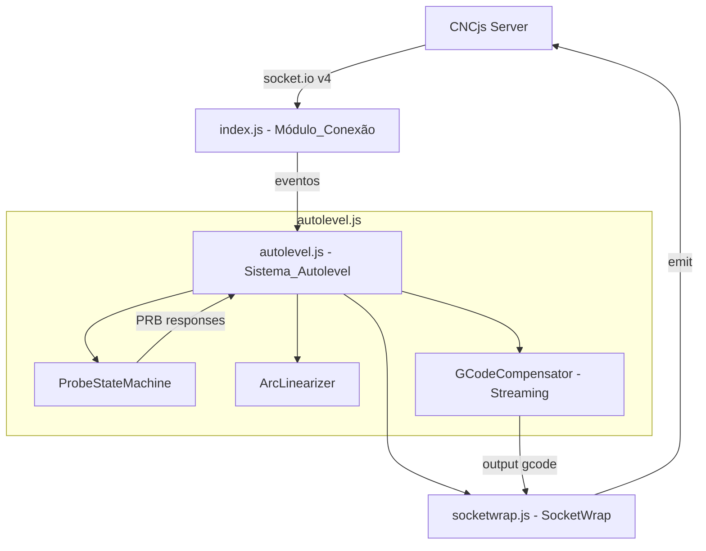
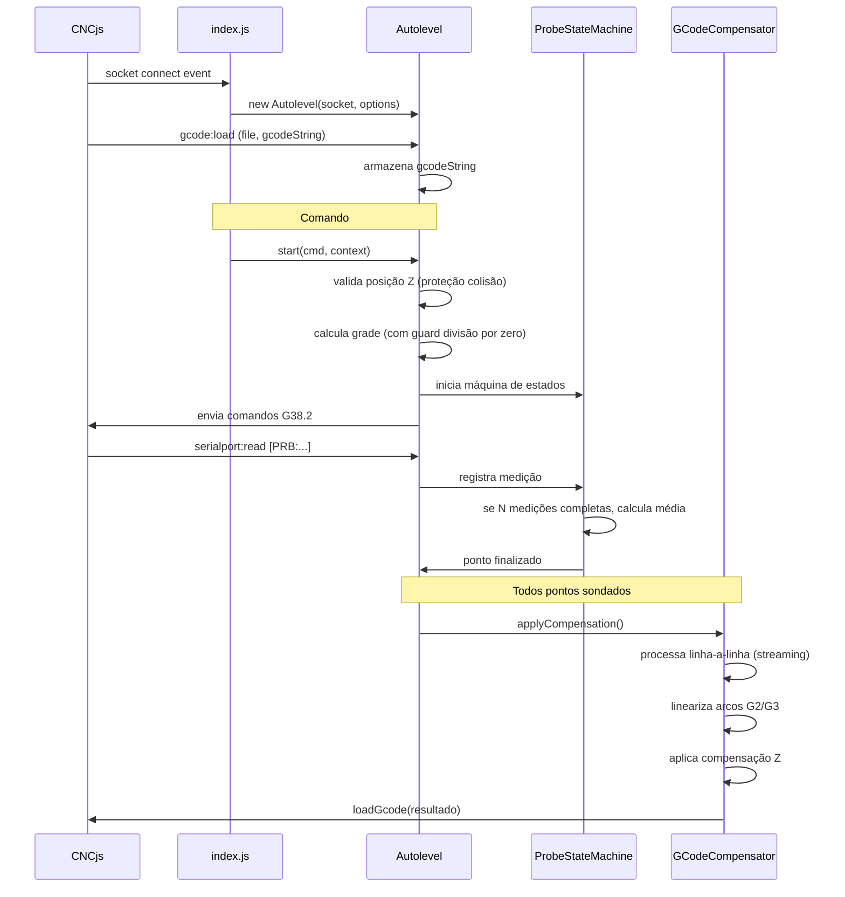

# Design Document

## Overview

Este documento descreve o design técnico para as melhorias na extensão cncjs-kt-ext de auto-nivelamento. O projeto abrange correção de bugs críticos (divisão por zero), proteção contra colisão, suporte a arcos G2/G3, modernização de dependências (socket.io v4, commander v12), sondagem com múltiplas medições, otimização de memória para arquivos grandes, e melhorias no tratamento de erros.

A arquitetura mantém a estrutura modular existente (index.js, autolevel.js, socketwrap.js) mas refatora internamente cada módulo para suportar as novas funcionalidades. O processamento de G-code continua recebendo dados via evento socket (`gcode:load`), mas a compensação passa a usar streaming interno linha-a-linha para reduzir consumo de memória.

### Decisões de Design Principais

1. **socket.io v2 → v4**: Substituir `io.connect(url, { query: 'token=...' })` por `io(url, { query: { token: '...' } })`. A opção `auth` do v4 não é usada porque o CNCjs espera o token como query parameter.
2. **commander v2 → v12**: Substituir acesso direto `program.port` por `program.opts().port`. Usar `new Command()` em vez do singleton global.
3. **Linearização de arcos**: Algoritmo que calcula centro do arco a partir de I/J (offset incremental) ou R (raio), gera pontos ao longo do arco com espaçamento máximo de delta/2, e emite segmentos G1.
4. **Streaming de G-code**: O G-code é recebido como string via socket event (não podemos mudar isso). A otimização consiste em processar a string linha-a-linha sem criar array intermediário completo, usando um buffer de saída que é concatenado incrementalmente.
5. **Multi-probe**: Máquina de estados que conta respostas PRB por ponto, acumula medições, e só avança para o próximo ponto após N medições.
6. **Divisão por zero**: Guard no resultado de `parseInt()` — se o divisor é zero, usar 1 (um único ponto no eixo).
7. **Proteção contra colisão**: Verificar `context.posz` contra `this.height` antes de emitir qualquer comando de movimento.

## Architecture



### Fluxo de Dados Principal



## Components and Interfaces

### 1. Módulo_Conexão (index.js)

**Responsabilidade**: Parsing de CLI, conexão WebSocket, roteamento de eventos.

```javascript
// Interface modernizada com commander v12
import { Command } from 'commander';
const program = new Command();
program
  .version(pkg.version)
  .option('-i, --id <id>', 'the id stored in the ~/.cncrc file')
  // ... demais opções
  .parse(process.argv);

const opts = program.opts(); // v12: acesso via .opts()

// Conexão socket.io v4
import { io } from 'socket.io-client';
const socket = io(`ws://${opts.socketAddress}:${opts.socketPort}`, {
  query: { token: token },  // v4: objeto em vez de string
  reconnection: true,
  reconnectionAttempts: 3,
  reconnectionDelay: 5000,
  timeout: 10000
});
```

**Mudanças de API socket.io v2 → v4**:
- `require('socket.io-client')` → `const { io } = require('socket.io-client')` (ou import)
- `io.connect(url, { query: 'token=' + token })` → `io(url, { query: { token } })`
- Eventos `connect`, `error`, `disconnect` mantêm mesma assinatura
- `socket.destroy()` → `socket.disconnect()`

**Mudanças de API commander v2 → v12**:
- `program.port` → `program.opts().port`
- `program.name` (conflito com método) → `program.opts().name`
- Parsing continua com `program.parse(process.argv)`

### 2. ProbeStateMachine (novo componente em autolevel.js)

**Responsabilidade**: Gerenciar múltiplas medições por ponto, calcular média, rejeitar outliers.

```javascript
class ProbeStateMachine {
  constructor(probesPerPoint, totalPoints) {
    this.probesPerPoint = probesPerPoint; // N (1-10)
    this.totalPoints = totalPoints;
    this.currentPointIndex = 0;
    this.currentMeasurements = []; // medições Z do ponto atual
    this.completedPoints = []; // pontos finalizados {x, y, z}
  }

  // Registra uma medição PRB recebida
  // Retorna: { pointComplete: boolean, allComplete: boolean, point?: {x,y,z} }
  addMeasurement(x, y, z) { ... }

  // Calcula média com rejeição de outliers (2σ) para N >= 4
  calculateAverage(measurements) { ... }

  // Gera comandos G-code para re-probe do mesmo ponto
  getRepeatProbeCommands(height, feed) { ... }

  // Reset para nova sessão de sondagem
  reset() { ... }
}
```

**Máquina de estados**:
- Estado IDLE → PROBING (ao iniciar)
- Estado PROBING: recebe PRB, incrementa contador de medições
  - Se medições < N: emite comandos para elevar Z e re-sondar mesmo ponto
  - Se medições == N: calcula média, avança para próximo ponto
- Estado COMPLETE: todos os pontos finalizados

### 3. ArcLinearizer (novo componente em autolevel.js)

**Responsabilidade**: Converter comandos G2/G3 em sequência de segmentos G1.

```javascript
class ArcLinearizer {
  constructor(maxSegmentLength) {
    this.maxSegmentLength = maxSegmentLength; // delta / 2
  }

  // Lineariza um arco no plano XY
  // Retorna: array de pontos [{x, y, z}, ...]
  linearize(startPoint, endPoint, params, clockwise) { ... }

  // Calcula centro do arco a partir de I, J (offsets incrementais)
  calculateCenterIJ(start, i, j) {
    return { x: start.x + i, y: start.y + j };
  }

  // Calcula centro do arco a partir de R (raio)
  // Retorna os dois centros possíveis; seleciona baseado em convenção:
  // R > 0 → arco menor (< 180°), R < 0 → arco maior (> 180°)
  calculateCenterR(start, end, r, clockwise) { ... }

  // Valida consistência: |center-start| ≈ |center-end| (tolerância 0.001mm)
  validateArc(center, start, end) { ... }

  // Gera pontos ao longo do arco com espaçamento máximo
  generatePoints(center, radius, startAngle, endAngle, clockwise, startZ, endZ) { ... }
}
```

**Algoritmo de linearização**:
1. Calcular centro do arco (via I/J ou R)
2. Calcular raio = distância(centro, ponto_inicial)
3. Validar: |distância(centro, ponto_final) - raio| < 0.001mm
4. Calcular ângulo inicial e final usando `atan2`
5. Determinar ângulo total do arco (considerando direção CW/CCW)
6. Calcular número de segmentos: `ceil(arco_comprimento / maxSegmentLength)`
7. Gerar pontos intermediários com interpolação linear de Z

### 4. GCodeCompensator (refatoração de applyCompensation em autolevel.js)

**Responsabilidade**: Processar G-code com streaming, aplicar compensação Z, linearizar arcos.

```javascript
class GCodeCompensator {
  constructor(probedPoints, delta, arcLinearizer) {
    this.probedPoints = probedPoints;
    this.delta = delta;
    this.arcLinearizer = arcLinearizer;
  }

  // Processa G-code string via streaming interno
  // Em vez de split('\n') + array result, usa iteração por índice
  process(gcodeString, progressCallback) {
    let result = '';
    let lineStart = 0;
    let lineCount = 0;
    let totalLines = this.countLines(gcodeString);
    
    for (let i = 0; i <= gcodeString.length; i++) {
      if (i === gcodeString.length || gcodeString[i] === '\n') {
        const line = gcodeString.substring(lineStart, i);
        const processed = this.processLine(line);
        result += processed + '\n';
        lineStart = i + 1;
        lineCount++;
        if (lineCount % 5000 === 0) {
          progressCallback(lineCount, totalLines);
        }
      }
    }
    return result;
  }

  // Processa uma única linha de G-code
  processLine(line) { ... }

  // Detecta e processa comandos G2/G3
  processArc(lineStripped, currentPos, units, abs) { ... }

  // Conta linhas sem criar array (O(n) scan)
  countLines(str) { ... }
}
```

**Estratégia de streaming**:
- O G-code chega como string via socket event (restrição do CNCjs)
- Em vez de `gcode.split('\n')` que cria array com todas as linhas em memória, iteramos pela string usando índices
- O resultado é construído por concatenação incremental
- Isso reduz o pico de memória de ~3x o tamanho do arquivo (string original + array de linhas + array de resultado) para ~2x (string original + string resultado)
- Para arquivos muito grandes, a string resultado pode ser escrita em chunks para arquivo em disco

### 5. SocketWrap (socketwrap.js)

**Responsabilidade**: Wrapper para emissão de comandos via socket. Interface mantida, sem mudanças na API pública.

```javascript
class SocketWrap {
  constructor(socket, port) {
    this.socket = socket;
    this.port = port;
  }

  sendGcode(gcode) {
    this.socket.emit('command', this.port, 'gcode', gcode);
  }

  loadGcode(name, gcode) {
    this.socket.emit('command', this.port, 'gcode:load', name, gcode);
  }

  stopGcode() {
    this.socket.emit('command', this.port, 'gcode:stop', { force: true });
  }
}
```

## Data Models

### Ponto Sondado
```javascript
{
  x: Number,  // coordenada X em work coordinates (mm)
  y: Number,  // coordenada Y em work coordinates (mm)
  z: Number   // coordenada Z medida (mm)
}
```

### Contexto de Posição (recebido do CNCjs)
```javascript
{
  mposx: Number,  // posição máquina X
  mposy: Number,  // posição máquina Y
  mposz: Number,  // posição máquina Z
  posx: Number,   // posição trabalho X
  posy: Number,   // posição trabalho Y
  posz: Number,   // posição trabalho Z
  xmin: Number,   // limite mínimo X do G-code
  xmax: Number,   // limite máximo X do G-code
  ymin: Number,   // limite mínimo Y do G-code
  ymax: Number    // limite máximo Y do G-code
}
```

### Parâmetros de Arco (parseados de linha G-code)
```javascript
{
  command: 'G2' | 'G3',  // direção do arco
  x: Number | null,      // ponto final X (absoluto ou relativo)
  y: Number | null,      // ponto final Y
  z: Number | null,      // ponto final Z
  i: Number | null,      // offset X ao centro (incremental)
  j: Number | null,      // offset Y ao centro (incremental)
  r: Number | null,      // raio (alternativa a I/J)
  f: Number | null       // feedrate
}
```

### Estado da Máquina de Sondagem
```javascript
{
  probesPerPoint: Number,       // N medições por ponto (1-10)
  totalPoints: Number,          // total de pontos na grade
  currentPointIndex: Number,    // índice do ponto atual (0-based)
  currentMeasurements: Array,   // medições Z do ponto atual [{x, y, z}]
  completedPoints: Array,       // pontos finalizados [{x, y, z}]
  state: 'IDLE' | 'PROBING' | 'COMPLETE'
}
```

### Opções de Comando #autolevel (estendidas)
```
#autolevel D<delta> H<height> F<feed> M<margin> X<xSize> Y<ySize> P<probeOnly> N<probesPerPoint>
```
- `D`: espaçamento da grade (mm), padrão 10
- `H`: altura de deslocamento (mm), padrão 2
- `F`: feedrate de sondagem (mm/min), padrão 50
- `M`: margem interna (mm), padrão delta/4
- `X`, `Y`: tamanho da área (opcional, senão usa limites do G-code)
- `P`: 1 = apenas sondar sem aplicar compensação
- `N`: número de medições por ponto (1-10), padrão 1

### Formato do Arquivo de Sondagem
```
X1 Y1 Z1 0 0 0 0 0 0
X2 Y2 Z2 0 0 0 0 0 0
...
```
Formato compatível com LinuxCNC (9 valores por linha, separados por espaço). Apenas os 3 primeiros valores (X, Y, Z) são utilizados; os demais são zeros para compatibilidade.

### Configuração de Conexão (modernizada)
```javascript
{
  id: String,
  name: String,
  secret: String,
  port: String,           // porta serial (ex: '/dev/ttyACM0', 'COM3')
  baudrate: Number,
  socketAddress: String,  // endereço do servidor CNCjs
  socketPort: Number,     // porta do servidor CNCjs
  controllerType: String, // 'Grbl' | 'Smoothie' | 'TinyG'
  accessTokenLifetime: String,
  outDir: String          // diretório de saída para arquivos
}
```


## Correctness Properties

*Uma propriedade é uma característica ou comportamento que deve ser verdadeiro em todas as execuções válidas de um sistema — essencialmente, uma declaração formal sobre o que o sistema deve fazer. Propriedades servem como ponte entre especificações legíveis por humanos e garantias de correção verificáveis por máquina.*

### Property 1: Cálculo da grade produz coordenadas finitas válidas

*For any* combinação válida de área de sondagem (xmin < xmax, ymin < ymax) e delta > 0, todas as coordenadas de sondagem geradas pelo Módulo_Probing SHALL ser números finitos (não NaN, não Infinity), e quando a área em um eixo é menor ou igual ao delta, SHALL usar exatamente um ponto no ponto médio daquele eixo.

**Validates: Requirements 1.1, 1.2, 1.4**

### Property 2: Proteção contra colisão impede movimento quando Z é inseguro

*For any* posição Z atual em coordenadas de trabalho que é menor que a altura de deslocamento configurada (H), o Módulo_Probing SHALL não emitir nenhum comando de movimento G-code, e quando a posição Z é válida (>= H), o primeiro comando de movimento SHALL ser G0 Z para a altura de deslocamento antes de qualquer movimento XY.

**Validates: Requirements 2.2, 2.3**

### Property 3: Linearização de arco produz segmentos válidos

*For any* arco G2/G3 válido (com parâmetros I/J ou R consistentes) no plano XY, a linearização SHALL produzir segmentos G1 onde: (a) cada segmento tem comprimento ≤ delta/2, (b) o primeiro ponto coincide com o ponto inicial do arco, (c) o último ponto coincide com o ponto final do arco (tolerância 0.001mm), (d) o feedrate original é preservado em todos os segmentos, e (e) para arcos completos (ponto final == ponto inicial), a linearização cobre 360°.

**Validates: Requirements 3.1, 3.3, 3.6**

### Property 4: Cálculo do centro do arco é geometricamente consistente

*For any* arco definido por ponto inicial, ponto final e parâmetros I/J, o centro calculado SHALL ser igual a (start.x + I, start.y + J). Para arcos definidos por R, o centro calculado SHALL ser equidistante do ponto inicial e do ponto final com diferença máxima de 0.001mm.

**Validates: Requirements 3.4**

### Property 5: Arcos com parâmetros inconsistentes são preservados sem modificação

*For any* comando G2/G3 onde a distância entre o centro calculado e o ponto inicial difere da distância entre o centro e o ponto final em mais de 0.001mm, a linha de saída SHALL ser idêntica à linha de entrada (pass-through sem modificação).

**Validates: Requirements 3.5**

### Property 6: Compensação Z é aplicada a cada ponto de arco linearizado

*For any* arco linearizado em segmentos e qualquer conjunto de pontos sondados com pelo menos 3 pontos não-colineares, cada ponto de segmento resultante SHALL ter coordenada Z ajustada pela interpolação dos 3 pontos sondados mais próximos (compensação via plano de 3 pontos).

**Validates: Requirements 3.2**

### Property 7: Média multi-probe com rejeição de outliers

*For any* conjunto de N medições (2 ≤ N ≤ 10) para um ponto, o valor Z resultante SHALL ser a média aritmética das medições válidas. Quando N ≥ 4, medições que desviam mais de 2 desvios-padrão da média SHALL ser excluídas antes do cálculo final.

**Validates: Requirements 5.1, 5.3**

### Property 8: Elevação Z entre medições do mesmo ponto

*For any* sequência de sondagem com N > 1 medições por ponto, os comandos G-code gerados SHALL conter um comando de elevação Z (G0 Z{height}) entre cada comando G38.2 consecutivo para o mesmo ponto.

**Validates: Requirements 5.5**

### Property 9: Equivalência de saída entre streaming e processamento em memória

*For any* string G-code e conjunto de pontos sondados, o processamento via streaming linha-a-linha SHALL produzir saída numericamente idêntica (±0.0005mm por coordenada) ao processamento que carrega todas as linhas em memória.

**Validates: Requirements 6.3**

### Property 10: Round-trip de dados de sondagem (salvar/carregar)

*For any* conjunto de pontos sondados com coordenadas finitas, salvar os pontos em arquivo no formato especificado e carregar de volta SHALL produzir coordenadas com diferença máxima de 0.001mm em relação aos valores originais.

**Validates: Requirements 8.6, 8.1**

### Property 11: Validação de integridade dos dados de sondagem

*For any* conteúdo de arquivo de sondagem, a validação SHALL aceitar o arquivo se e somente se: (a) cada linha contém pelo menos 3 valores numéricos finitos, e (b) o conjunto total contém no mínimo 3 pontos não-colineares. Caso contrário, SHALL rejeitar todos os dados.

**Validates: Requirements 8.4, 8.5**

### Property 12: Linhas G-code com erro de parsing são preservadas

*For any* linha G-code que causa erro de parsing (sintaxe inválida, parâmetros malformados), o Módulo_Compensação SHALL copiar a linha original sem modificação para a saída e continuar processando as linhas subsequentes.

**Validates: Requirements 7.5**

### Property 13: Resumo de sondagem contém todas as informações requeridas

*For any* configuração de sondagem válida (área, delta, feedrate, altura), a mensagem de resumo enviada ao console SHALL conter: número total de pontos, limites Xmin/Xmax/Ymin/Ymax, delta em mm, feedrate em mm/min, e tempo estimado.

**Validates: Requirements 7.4**

## Error Handling

### Erros de Conexão

| Cenário | Ação | Recuperação |
|---------|------|-------------|
| Timeout de conexão (>10s) | Log de erro com endereço do servidor | Encerrar processo com exit code 1 |
| Perda de conexão durante sondagem | Tentar reconectar 3x com intervalo 5s | Se falhar: salvar dados parciais, enviar stop, encerrar |
| Erro de autenticação (token inválido) | Log de erro indicando falha de auth | Encerrar processo |

### Erros de Sondagem

| Cenário | Ação | Recuperação |
|---------|------|-------------|
| G38.2 sem contato (probe fail) | Retrair Z até travel height | Abortar sequência, enviar mensagem com ponto e coordenadas |
| Posição Z insegura | Cancelar antes de emitir comandos | Mensagem indicando Z atual e mínimo necessário |
| Contexto indefinido (sem dados de posição) | Abortar operação | Mensagem indicando impossibilidade de verificar Z |
| Divisão por zero na grade | Usar ponto médio do eixo | Continuar com grade reduzida |
| Parâmetros NaN/Infinity | Rejeitar operação | Mensagem indicando eixo com valor inválido |

### Erros de Compensação

| Cenário | Ação | Recuperação |
|---------|------|-------------|
| Erro de parsing em linha G-code | Copiar linha original sem modificação | Log com número da linha, continuar processamento |
| Arco com parâmetros inconsistentes | Copiar linha original sem modificação | Log de aviso, continuar |
| Menos de 3 pontos sondados | Rejeitar compensação | Mensagem indicando insuficiência de dados |
| Erro de I/O durante escrita de arquivo | Interromper processamento | Descartar saída parcial, mensagem de erro |

### Erros de Dados de Sondagem

| Cenário | Ação | Recuperação |
|---------|------|-------------|
| Arquivo não encontrado ao iniciar | Iniciar sem dados | Mensagem informativa no console |
| Arquivo com formato inválido | Descartar todos os dados | Mensagem de erro, iniciar sem dados |
| Pontos colineares (< 3 não-colineares) | Descartar todos os dados | Mensagem indicando dados insuficientes |
| Valores NaN/Infinity no arquivo | Descartar todos os dados | Mensagem indicando dados corrompidos |

## Testing Strategy

### Abordagem Dual de Testes

A estratégia combina testes unitários baseados em exemplos com testes baseados em propriedades (property-based testing) para cobertura abrangente.

### Testes Baseados em Propriedades (PBT)

**Biblioteca**: [fast-check](https://github.com/dubzzz/fast-check) (JavaScript/Node.js)

**Configuração**: Mínimo 100 iterações por teste de propriedade.

**Tag format**: `Feature: cncjs-autolevel-improvements, Property {number}: {property_text}`

Cada propriedade de correção definida na seção anterior será implementada como um único teste baseado em propriedades usando fast-check:

| Propriedade | Gerador de Entrada | Verificação |
|-------------|-------------------|-------------|
| P1: Grade finita | `fc.record({ xmin, xmax, delta })` com constraints | Todas coordenadas `Number.isFinite()` |
| P2: Proteção colisão | `fc.record({ posz, height })` | Sem comandos G quando posz < height |
| P3: Segmentos de arco | `fc.record({ start, end, i, j, radius })` | Comprimento ≤ delta/2, continuidade |
| P4: Centro do arco | `fc.record({ start, i, j })` | Centro = start + offset |
| P5: Arco inválido pass-through | Arcos com inconsistência > 0.001mm | Saída == entrada |
| P6: Compensação Z em arcos | Arcos + pontos sondados | Z ajustado em cada ponto |
| P7: Média multi-probe | `fc.array(fc.float(), {minLength: 2, maxLength: 10})` | Média correta, outliers excluídos |
| P8: Elevação Z entre probes | `fc.integer({min: 2, max: 10})` | G0 Z entre cada G38.2 |
| P9: Equivalência streaming | G-code aleatório + pontos | Saída streaming == saída batch |
| P10: Round-trip sondagem | `fc.array(fc.record({x, y, z}))` | |save-load| ≤ 0.001mm |
| P11: Validação dados | Arquivos válidos e inválidos | Aceita/rejeita corretamente |
| P12: Parsing error pass-through | Linhas G-code inválidas | Saída == entrada para linhas inválidas |
| P13: Resumo completo | Configurações aleatórias | Mensagem contém todos campos |

### Testes Unitários (Exemplos)

Testes unitários focam em cenários específicos e integração:

1. **Conexão socket.io v4**: Verificar que token é enviado como query parameter
2. **Commander v12**: Verificar parsing correto de todos os argumentos CLI
3. **Timeout de conexão**: Verificar encerramento após 10s sem resposta
4. **Probe failure**: Verificar retração e abort quando G38.2 falha
5. **Reconexão**: Verificar 3 tentativas com intervalo de 5s
6. **Progresso**: Verificar mensagens a cada 5000 linhas
7. **Comportamento padrão N=1**: Verificar sondagem única quando N não especificado

### Testes de Integração

1. **Memória com arquivo grande**: Processar arquivo >100k linhas, medir heap < 50MB adicional
2. **Conexão real com CNCjs**: Verificar handshake socket.io v4 com servidor CNCjs
3. **Node.js 18+**: Verificar execução sem erros de runtime

### Estrutura de Arquivos de Teste

```
test/
├── properties/
│   ├── grid-calculation.property.test.js
│   ├── arc-linearization.property.test.js
│   ├── arc-center.property.test.js
│   ├── multi-probe.property.test.js
│   ├── streaming-equivalence.property.test.js
│   ├── probe-data-roundtrip.property.test.js
│   ├── data-validation.property.test.js
│   ├── compensation-passthrough.property.test.js
│   └── collision-protection.property.test.js
├── unit/
│   ├── autolevel.test.js
│   ├── arc-linearizer.test.js
│   ├── probe-state-machine.test.js
│   ├── gcode-compensator.test.js
│   └── connection.test.js
└── integration/
    ├── memory-usage.test.js
    └── socket-connection.test.js
```

### Framework de Testes

- **Test runner**: Vitest (compatível com Node.js 18+, rápido, suporte ESM)
- **PBT library**: fast-check
- **Assertions**: Vitest built-in (`expect`)
- **Mocking**: Vitest built-in (`vi.fn()`, `vi.mock()`)
